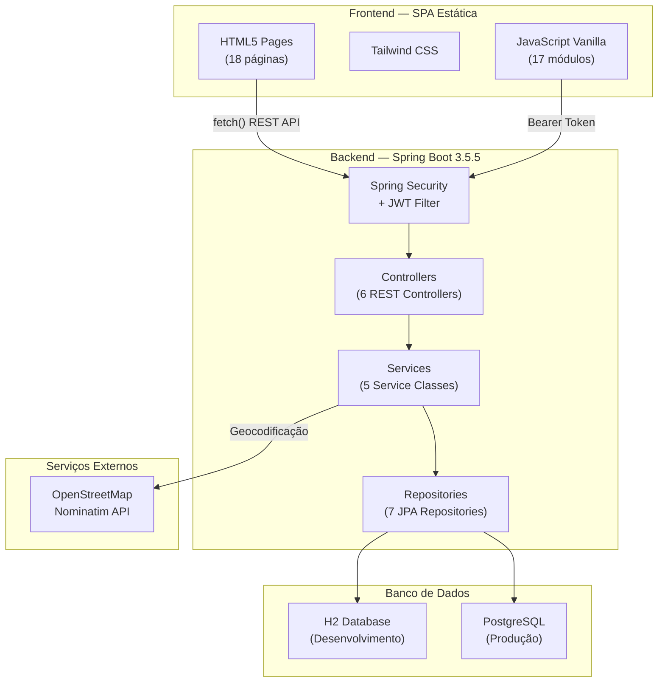
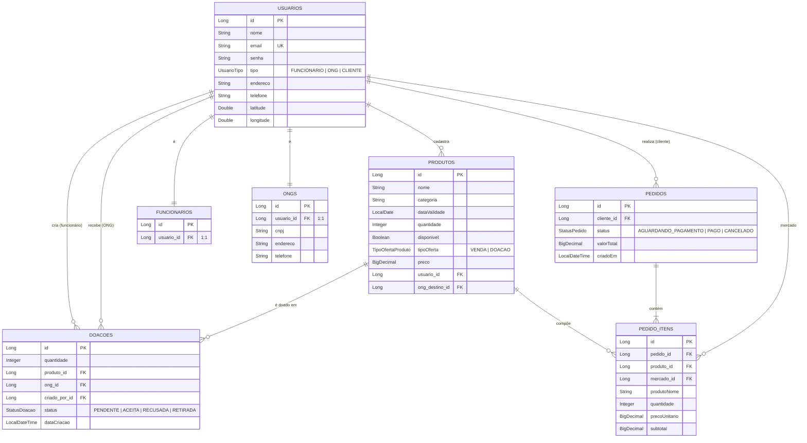
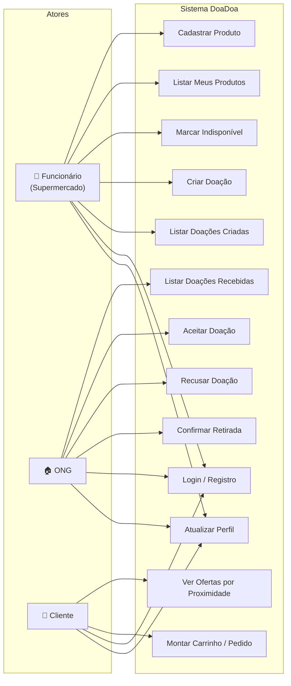
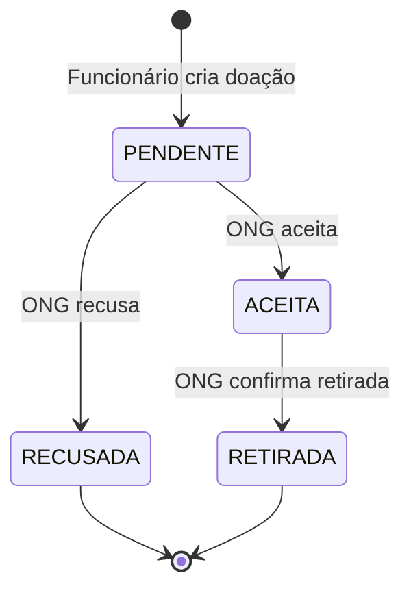
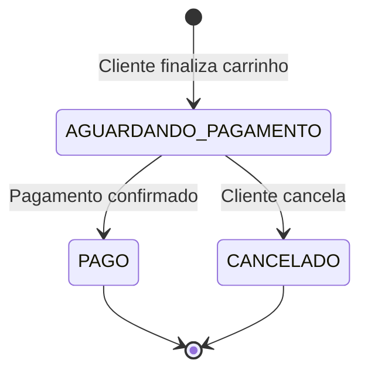
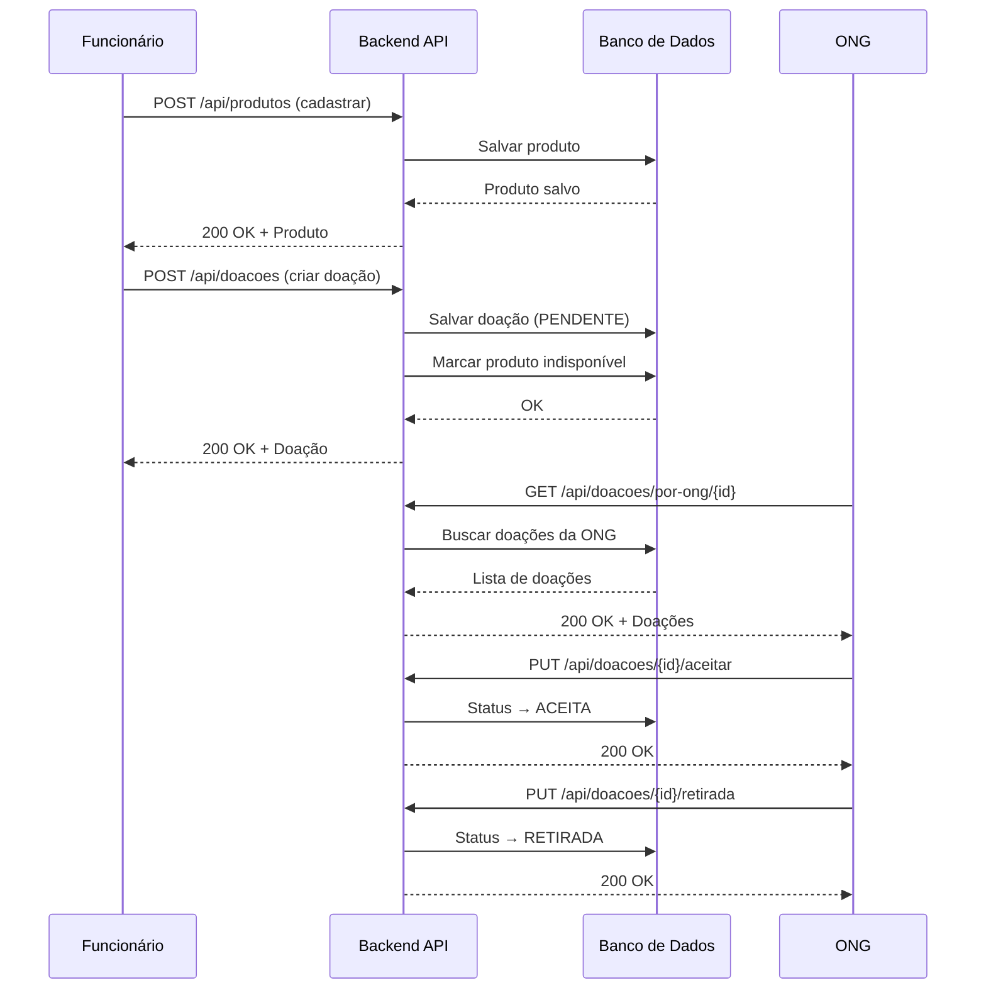

<div align="center">

# 🍎 DoaDoa — Sistema de Doação de Alimentos

**Trabalho de Conclusão de Curso — Ciência da Computação**

Sistema web para combate ao desperdício alimentar, conectando supermercados, ONGs e clientes em uma plataforma integrada com geolocalização.

[]()
[]()
[]()

</div>

---

## Equipe

| Nome | RA |
|------|-----|
| Felipe Carvalho | 10409804 |
| Giulia Araki | 10408954 |
| Maria Gabriela de Barros | 10409037 |
| Raphaela Polonis | 10408843 |


---

## Sumário

1. [Introdução](#1-introdução)
2. [Fundamentação Teórica](#2-fundamentação-teórica)
3. [Arquitetura do Sistema](#3-arquitetura-do-sistema)
4. [Modelagem de Dados](#4-modelagem-de-dados)
5. [Diagramas UML](#5-diagramas-uml)
6. [API REST — Documentação dos Endpoints](#6-api-rest--documentação-dos-endpoints)
7. [Segurança](#7-segurança)
8. [Como Executar](#8-como-executar)
9. [Testes](#9-testes)
10. [Estrutura do Projeto](#10-estrutura-do-projeto)
11. [Considerações Finais](#11-considerações-finais)
12. [Referências](#12-referências)

---

# 1. Introdução

## 1.1 Contexto

O **DoaDoa** é um sistema web desenvolvido como Trabalho de Conclusão de Curso (TCC) para o curso de Ciência da Computação. A plataforma aborda o problema do **desperdício de alimentos** ao conectar três atores:

- **Funcionários de supermercados** — cadastram produtos próximos à validade e criam doações para ONGs
- **ONGs** — recebem, aceitam e retiram doações de alimentos
- **Clientes** — compram produtos com desconto por proximidade geográfica

## 1.2 Objetivos

| Objetivo | Descrição |
|----------|-----------|
| **Reduzir desperdício** | Disponibilizar produtos antes do descarte |
| **Conectar doadores e ONGs** | Plataforma centralizada com fluxo rastreável |
| **Geolocalização** | Ordenar mercados por proximidade para clientes |
| **Rastreabilidade** | Ciclo completo: cadastro → doação → aceite → retirada |
| **Segurança** | Autenticação JWT, proteção IDOR, senhas com BCrypt |

---

---

# 2. Fundamentação Teórica

## 2.1 Desperdício de Alimentos no Brasil

O Brasil ocupa posição preocupante nos rankings mundiais de desperdício alimentar — estima-se que cerca de **27 milhões de toneladas** de alimentos são descartados anualmente (FAO, 2023). Simultaneamente, aproximadamente **33 milhões de brasileiros** vivem em situação de insegurança alimentar grave. Supermercados, restaurantes e centrais de abastecimento descartam diariamente produtos próximos à validade que ainda são próprios para consumo.

## 2.2 Economia Circular e Tecnologia

Soluções digitais baseadas no conceito de **economia circular** permitem conectar geradores de excedente a organizações sociais de forma eficiente, rastreável e escalável. Plataformas web com geolocalização facilitam a logística reversa e reduzem o tempo entre a disponibilização e a retirada do alimento.

## 2.3 Tecnologias Adotadas

O projeto utiliza uma stack moderna e consolidada:

| Camada | Tecnologia | Justificativa |
|--------|-----------|---------------|
| **Backend** | Java 17 + Spring Boot 3.5.5 | Framework maduro, amplamente adotado no mercado, com ecossistema robusto para APIs REST |
| **Segurança** | Spring Security + JWT (jjwt 0.12.6) | Autenticação stateless adequada para SPAs, padrão de mercado |
| **Persistência** | Spring Data JPA + H2/PostgreSQL | ORM produtivo com suporte a múltiplos bancos via perfis |
| **Frontend** | HTML5 + Tailwind CSS + JavaScript Vanilla | Leve, sem dependência de frameworks pesados, carregamento rápido |
| **Geolocalização** | OpenStreetMap Nominatim + Haversine | API de geocodificação gratuita e fórmula precisa para cálculo de distância |
| **Build** | Maven 3.11 | Gerenciamento de dependências e ciclo de build padronizado |
| **Documentação API** | Swagger/OpenAPI 3.0 (springdoc) | Documentação interativa gerada automaticamente |
| **Cobertura de Testes** | JaCoCo | Relatórios de cobertura de código durante build |

---

# 3. Arquitetura do Sistema

## 3.1 Visão Geral

O DoaDoa segue uma **arquitetura monolítica em camadas** (Layered Architecture), padrão adequado para o escopo acadêmico, com clara separação de responsabilidades entre Controller → Service → Repository.



## 3.2 Diagrama de Pacotes

```
com.tcc.desperdicio_alimentos/
├── config/               # SecurityConfig, JwtService, JwtAuthFilter
├── controller/           # 6 REST Controllers
├── dto/                  # Request/Response DTOs
├── model/                # 7 Entidades JPA + 4 Enums
├── repository/           # 7 Spring Data Repositories
└── service/              # 5 Service Classes
```

---

# 4. Modelagem de Dados

## 4.1 Diagrama Entidade-Relacionamento



## 4.2 Enumerações

| Enum | Valores | Uso |
|------|---------|-----|
| `UsuarioTipo` | `FUNCIONARIO`, `ONG`, `CLIENTE` | Define o papel do usuário no sistema |
| `StatusDoacao` | `PENDENTE`, `ACEITA`, `RECUSADA`, `RETIRADA` | Ciclo de vida da doação |
| `StatusPedido` | `AGUARDANDO_PAGAMENTO`, `PAGO`, `CANCELADO` | Ciclo de vida do pedido (venda) |
| `TipoOfertaProduto` | `VENDA`, `DOACAO` | Tipo de oferta do produto |

---

# 5. Diagramas UML

## 5.1 Diagrama de Casos de Uso



## 5.2 Diagrama de Estados — Doação



## 5.3 Diagrama de Estados — Pedido



## 5.4 Diagrama de Sequência — Fluxo de Doação



---

# 6. API REST — Documentação dos Endpoints

> **Documentação interativa disponível em:** `http://localhost:8080/swagger-ui.html` (após iniciar o servidor)

## 6.1 Autenticação

Todas as rotas (exceto login e registro) exigem o header:
```
Authorization: Bearer <token_jwt>
```

## 6.2 Endpoints

### Usuários (`/api/usuarios`)

| Método | Rota | Auth | Descrição |
|--------|------|------|-----------|
| `POST` | `/api/usuarios/register` | ❌ | Registrar novo usuário (FUNCIONARIO, ONG ou CLIENTE) |
| `POST` | `/api/usuarios/login` | ❌ | Autenticar e receber JWT |
| `GET` | `/api/usuarios` | ✅ | Listar todos os usuários (resumo) |
| `PUT` | `/api/usuarios/{id}/perfil` | ✅ | Atualizar perfil (apenas próprio) |

### Produtos (`/api/produtos`)

| Método | Rota | Auth | Descrição |
|--------|------|------|-----------|
| `GET` | `/api/produtos` | ✅ | Listar todos os produtos |
| `POST` | `/api/produtos` | ✅ | Cadastrar novo produto |
| `GET` | `/api/produtos/disponiveis` | ✅ | Listar produtos disponíveis para doação |
| `GET` | `/api/produtos/ofertas` | ✅ | Listar ofertas para clientes (com busca e proximidade) |
| `GET` | `/api/produtos/por-usuario/{id}` | ✅ | Listar produtos do funcionário (verificação IDOR) |
| `PUT` | `/api/produtos/{id}/indisponivel` | ✅ | Marcar produto como indisponível (verificação IDOR) |

### Doações (`/api/doacoes`)

| Método | Rota | Auth | Descrição |
|--------|------|------|-----------|
| `POST` | `/api/doacoes` | ✅ | Criar doação (status inicial: PENDENTE) |
| `GET` | `/api/doacoes` | ✅ | Listar todas as doações |
| `GET` | `/api/doacoes/por-criador/{id}` | ✅ | Listar doações criadas pelo funcionário |
| `GET` | `/api/doacoes/por-ong/{id}` | ✅ | Listar doações destinadas à ONG |
| `PUT` | `/api/doacoes/{id}/aceitar` | ✅ | ONG aceita a doação |
| `PUT` | `/api/doacoes/{id}/recusar` | ✅ | ONG recusa a doação |
| `PUT` | `/api/doacoes/{id}/retirada` | ✅ | ONG confirma retirada |

### Pedidos (`/api/pedidos`)

| Método | Rota | Auth | Descrição |
|--------|------|------|-----------|
| `POST` | `/api/pedidos` | ✅ | Finalizar pedido de compra |

### ONGs (`/api/ongs`)

| Método | Rota | Auth | Descrição |
|--------|------|------|-----------|
| `GET` | `/api/ongs` | ✅ | Listar todas as ONGs cadastradas (resumo) |

### Funcionários (`/api/funcionarios`)

| Método | Rota | Auth | Descrição |
|--------|------|------|-----------|
| `GET` | `/api/funcionarios` | ✅ | Listar todos os funcionários |
| `GET` | `/api/funcionarios/por-usuario/{id}` | ✅ | Buscar funcionário por ID de usuário |

---

# 7. Segurança

O sistema implementa múltiplas camadas de segurança:

| Medida | Implementação |
|--------|---------------|
| **Autenticação** | JWT stateless com expiração configurável |
| **Hashing de senhas** | BCrypt (Spring Security) |
| **Proteção contra IDOR** | Verificação do `Authentication.getName()` nos endpoints sensíveis |
| **Validação de entrada** | Regex de e-mail, tamanho mínimo de senha (6 chars), campos obrigatórios |
| **Mensagens genéricas** | Login retorna "Credenciais inválidas" sem diferenciar e-mail/senha |
| **CSRF** | Desabilitado (adequado para API stateless com JWT) |
| **Console H2** | Habilitado apenas quando `spring.h2.console.enabled=true` |
| **Headers** | Frame options `sameOrigin` condicional |
| **DTOs** | Endpoints nunca expõem a entidade `Usuario` com senha |

---

# 8. Como Executar

## 8.1 Pré-requisitos

- **Java 17** (JDK)
- **Maven 3.8+** (ou usar o wrapper `./mvnw` incluso)

## 8.2 Backend (Desenvolvimento)

```bash
# Clonar o repositório
git clone https://github.com/seu-usuario/DoaDoa.git
cd Lab_Eng_Software

# Compilar e rodar em modo local (H2)
./mvnw clean install
./mvnw spring-boot:run
```

O servidor inicia em `http://localhost:8080`.

## 8.3 Backend (Produção — PostgreSQL)

```bash
export DB_URL=jdbc:postgresql://host:5432/doadoa
export DB_USER=seu_usuario
export DB_PASS=sua_senha

./mvnw spring-boot:run -Dspring-boot.run.profiles=prod
```

## 8.4 Frontend

O frontend é servido como **conteúdo estático** pelo próprio Spring Boot. Após iniciar o backend, acesse:

- **Página inicial:** `http://localhost:8080/index.html`
- **Login:** `http://localhost:8080/login.html`

Para desenvolvimento isolado do frontend:
```bash
cd src/main/resources/static
npx live-server --port=5500
```

## 8.5 Documentação da API (Swagger)

Após iniciar o servidor, acesse:
- **Swagger UI:** `http://localhost:8080/swagger-ui.html`
- **OpenAPI JSON:** `http://localhost:8080/v3/api-docs`

## 8.6 Relatório de Cobertura de Testes

```bash
./mvnw clean test jacoco:report
# Relatório gerado em: target/site/jacoco/index.html
```

---

# 9. Testes

## 9.1 Visão Geral

Os testes validam as regras de negócio e os endpoints REST. Ferramentas utilizadas:

| Ferramenta | Finalidade |
|------------|-----------|
| JUnit 5 | Framework de testes |
| Mockito | Mocking de dependências |
| MockMvc | Testes de controller HTTP |
| Spring Boot Test | Contexto de integração |
| H2 (memória) | Banco para testes de integração |
| JaCoCo | Relatório de cobertura |

## 9.2 Executar Testes

```bash
./mvnw clean test
```

## 9.3 Casos de Teste

### DoacaoService (5 testes)

| ID | Caso de Teste | Resultado Esperado |
|----|--------------|-------------------|
| CT-DS01 | Criar doação com sucesso | Status PENDENTE, produto indisponível |
| CT-DS02 | Criar doação com produto inexistente | 404 NOT_FOUND |
| CT-DS03 | Aceitar doação | Status → ACEITA |
| CT-DS04 | Recusar doação | Status → RECUSADA |
| CT-DS05 | Confirmar retirada | Status → RETIRADA |

### ProdutoService (3 testes)

| ID | Caso de Teste | Resultado Esperado |
|----|--------------|-------------------|
| CT-PS01 | Criar produto | `disponivel = true` |
| CT-PS02 | Criar com usuário inexistente | 404 NOT_FOUND |
| CT-PS03 | Listar produtos disponíveis | Apenas `disponivel = true` |

### UsuarioService (2 testes)

| ID | Caso de Teste | Resultado Esperado |
|----|--------------|-------------------|
| CT-US01 | Cadastrar usuário | Salvo com sucesso |
| CT-US02 | Cadastrar e-mail duplicado | `IllegalArgumentException` |

### Controllers — MockMvc (7 testes)

| ID | Endpoint | Resultado Esperado |
|----|---------|-------------------|
| CT-DC01 | POST /api/doacoes | 200 OK + JSON |
| CT-DC02 | PUT /api/doacoes/{id}/aceitar | 200 OK |
| CT-PC01 | POST /api/produtos | 200 OK |
| CT-PC02 | GET /api/produtos/disponiveis | 200 OK + lista |
| CT-UC01 | POST /api/usuarios/login (sucesso) | 200 OK |
| CT-UC02 | POST /api/usuarios/login (falha) | 401 UNAUTHORIZED |
| CT-OC01 | GET /api/ongs | 200 OK |

### Testes de Integração — Autorização (12 testes)

| ID | Caso de Teste | Resultado Esperado |
|----|--------------|-------------------|
| CT-AU01–12 | Verificação IDOR e permissões em endpoints protegidos | 403 FORBIDDEN para acesso não autorizado |

---

# 10. Estrutura do Projeto

```
Lab_Eng_Software/
├── pom.xml                                  # Configuração Maven
├── mvnw / mvnw.cmd                          # Maven Wrapper
├── src/
│   ├── main/
│   │   ├── java/com/tcc/desperdicio_alimentos/
│   │   │   ├── DesperdicioAlimentosApplication.java
│   │   │   ├── config/
│   │   │   │   ├── SecurityConfig.java      # Spring Security + JWT
│   │   │   │   ├── JwtService.java          # Geração/validação JWT
│   │   │   │   └── JwtAuthenticationFilter.java
│   │   │   ├── controller/
│   │   │   │   ├── UsuarioController.java   # Login, registro, perfil
│   │   │   │   ├── ProdutoController.java   # CRUD de produtos
│   │   │   │   ├── DoacaoController.java    # Fluxo de doações
│   │   │   │   ├── PedidoController.java    # Pedidos de compra
│   │   │   │   ├── OngController.java       # Listagem de ONGs
│   │   │   │   └── FuncionarioController.java
│   │   │   ├── dto/                         # DTOs de request/response
│   │   │   ├── model/
│   │   │   │   ├── Usuario.java
│   │   │   │   ├── Produto.java
│   │   │   │   ├── Doacao.java
│   │   │   │   ├── Pedido.java
│   │   │   │   ├── PedidoItem.java
│   │   │   │   ├── Funcionario.java
│   │   │   │   ├── Ong.java
│   │   │   │   └── enums (StatusDoacao, StatusPedido, TipoOfertaProduto, UsuarioTipo)
│   │   │   ├── repository/                  # 7 JPA Repositories
│   │   │   └── service/                     # 5 Services (regras de negócio)
│   │   └── resources/
│   │       ├── application.properties
│   │       ├── application-local.properties
│   │       ├── application-prod.properties
│   │       └── static/                      # 18 páginas HTML + CSS + JS
│   └── test/java/com/tcc/desperdicio_alimentos/
│       ├── controller/                      # Testes MockMvc
│       ├── service/                         # Testes unitários
│       └── integration/                     # Testes de integração
└── target/                                  # Build output
```

---

# 11. Considerações Finais

O sistema **DoaDoa** demonstra a aplicação prática de conceitos de Engenharia de Software em um problema social relevante. O projeto cobre:

- **Arquitetura em camadas** com separação clara de responsabilidades
- **API RESTful** documentada com Swagger/OpenAPI
- **Segurança** com JWT, BCrypt e proteção contra IDOR
- **Geolocalização** para conexão eficiente entre doadores e ONGs
- **Testes automatizados** com 29 casos de teste e relatório de cobertura JaCoCo
- **Perfis de ambiente** para desenvolvimento (H2) e produção (PostgreSQL)

### Possíveis Melhorias Futuras

| Melhoria | Descrição |
|----------|-----------|
| Dashboard de impacto | Métricas de kg doados, retiradas realizadas, ranking de ONGs |
| Notificações | Push/e-mail quando uma doação é aceita ou nova doação disponível |
| Docker Compose | Containerização completa (backend + PostgreSQL + nginx) |
| CI/CD | Pipeline GitHub Actions com build, testes e deploy automático |
| App Mobile | Versão React Native ou Flutter para maior acessibilidade |

---

# 12. Referências

- Spring Boot 3.x Documentation: https://docs.spring.io/spring-boot/docs/current/reference/html/
- Spring Security Reference: https://docs.spring.io/spring-security/reference/
- JSON Web Tokens (RFC 7519): https://datatracker.ietf.org/doc/html/rfc7519
- OpenStreetMap Nominatim: https://nominatim.org/release-docs/develop/
- FAO — Food Loss and Waste: https://www.fao.org/food-loss-and-food-waste/en/
- Tailwind CSS: https://tailwindcss.com/docs
- springdoc-openapi: https://springdoc.org/

---

# 📜 Licença

Este projeto é de uso **educacional**, desenvolvido como Trabalho de Conclusão de Curso (TCC) para o curso de Ciência da Computação.


